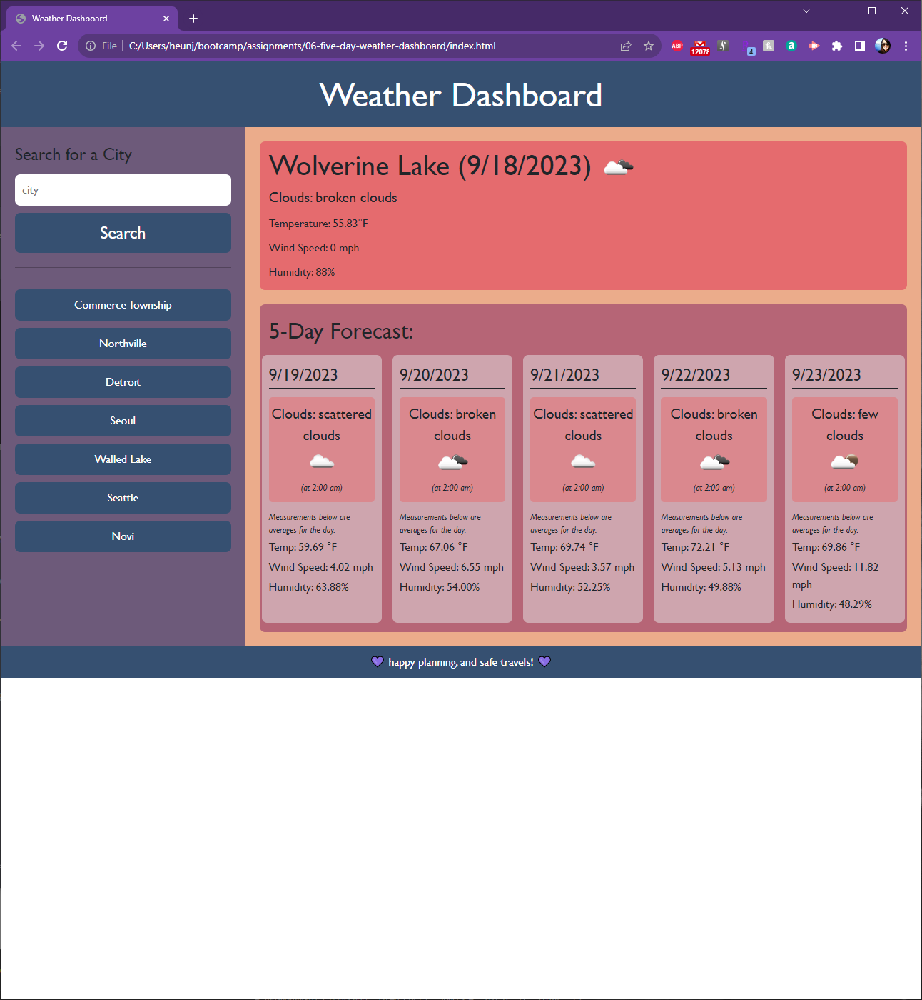

# 05-8-hour-work-day-hourly-scheduler-five-day-weather-dashboard

## Description

Weather application that allows a user to search for a city and then is presented with current conditions, future conditions for up to five days, and that city is also added to the user's search history. 

User can click on the cities in their search history to reloadCurrent weather data the weather data for that city.

### Three OpenWeather API calls:
* Geocoding API
* Current weather data
* 5 day weather forecast

### Notes: 
* The OpenWeather 5 day weather forecast API gives weather data for every 3 hours from time of API call (results in 40 dataset entries)
* In the application, the API data is processed to average the temperature, wind, and humidity for each day, and the application reflects these averages.
* In the 5-Day Forecast, the icon and weather desription is the first of its date (will match with the time of the API call).

## Installation

n/a

## Usage
Link to deployed application: https://hjlee17.github.io/06-five-day-weather-dashboard/

A user can search cities for the current and future weather conditions. The application 

## Credits

BootCampSpot

## Resources

[MDN Web Docs](developer.mozilla.org)\
[W3Schools](www.w3schools.com/)\
[stack overflow](stackoverflow.com/)

## License

MIT License

Copyright (c) 2023 hjlee17

Permission is hereby granted, free of charge, to any person obtaining a copy
of this software and associated documentation files (the "Software"), to deal
in the Software without restriction, including without limitation the rights
to use, copy, modify, merge, publish, distribute, sublicense, and/or sell
copies of the Software, and to permit persons to whom the Software is
furnished to do so, subject to the following conditions:

The above copyright notice and this permission notice shall be included in all
copies or substantial portions of the Software.

THE SOFTWARE IS PROVIDED "AS IS", WITHOUT WARRANTY OF ANY KIND, EXPRESS OR
IMPLIED, INCLUDING BUT NOT LIMITED TO THE WARRANTIES OF MERCHANTABILITY,
FITNESS FOR A PARTICULAR PURPOSE AND NONINFRINGEMENT. IN NO EVENT SHALL THE
AUTHORS OR COPYRIGHT HOLDERS BE LIABLE FOR ANY CLAIM, DAMAGES OR OTHER
LIABILITY, WHETHER IN AN ACTION OF CONTRACT, TORT OR OTHERWISE, ARISING FROM,
OUT OF OR IN CONNECTION WITH THE SOFTWARE OR THE USE OR OTHER DEALINGS IN THE
SOFTWARE.